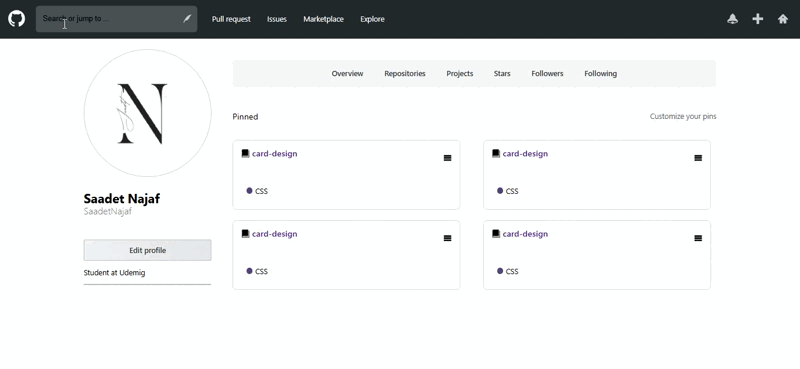

# 👩‍💻 GitHub Profile UI Clone

This is a responsive **GitHub Profile Page Clone**, built using **HTML**, **SCSS**, and **SVG icons**. It replicates the layout and design of a user's GitHub profile page — including profile information, pinned repositories, and navigation tabs — as a front-end project.

---

## ⚙️ Features

✅ **Fully Responsive Design**  
Works seamlessly on mobile, tablet, and desktop  

✅ **SVG Icon System**  
Includes scalable GitHub-style icons

✅ **Pinned Repositories Section**  
Stylish project cards with labels

✅ **Modern UI Layout**  
Inspired by GitHub’s real interface

✅ **SCSS Modular Codebase**  
Clean styling with variables and partials

✅ **Google Fonts Integration**  
Using the “Maven Pro” font for elegant typography

---

## 🛠 Technologies Used

- **HTML5** – Semantic markup for page structure  
- **SCSS (Sass)** – Modular, maintainable, and DRY styling  
- **SVG** – Icon system used for GitHub-like visuals  
- **Google Fonts (Maven Pro)** – Clean and professional typography

---

## 🔍 Preview

---

## 📞 Contact

📩 **Email**: [saadetnajaf@gmail.com](mailto:saadetnajaf@gmail.com)  
📷 **Instagram**: [@saadet_najaf](https://www.instagram.com/saadet_najaf)  
💼 **LinkedIn**: [Saadet Najaf](https://www.linkedin.com/in/saadetnajaf/) 
